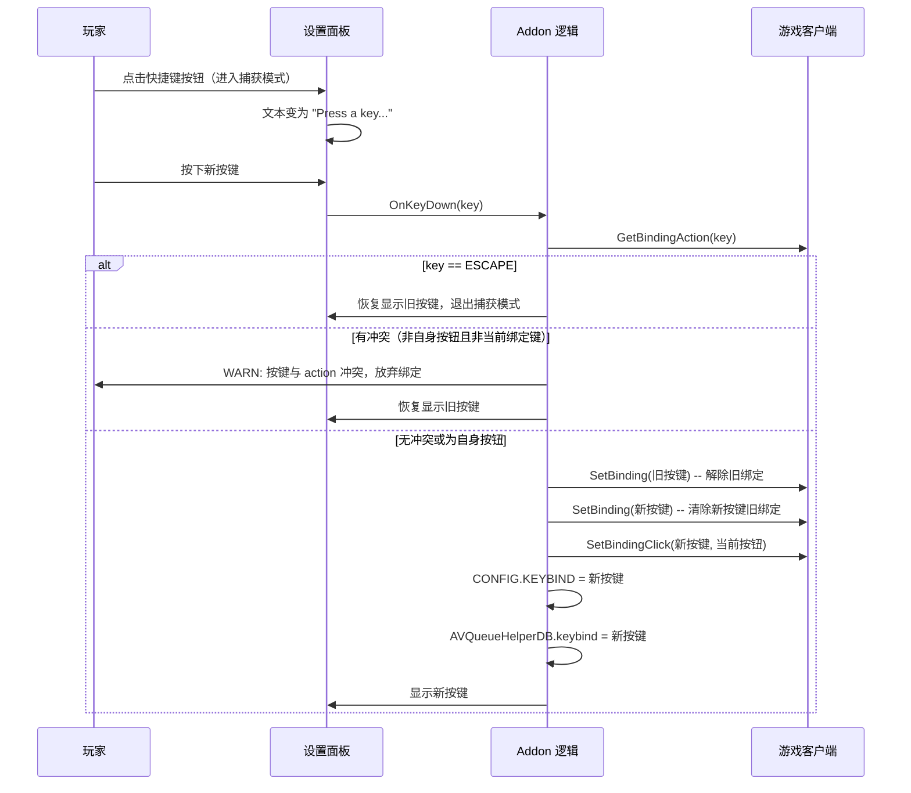

# 设计文档 — 设置界面面板

## 概述

本设计描述如何为 AVQueueHelper 插件添加设置界面面板功能。玩家可通过 `/avq` 斜杠命令打开设置面板，配置日志级别和快捷键绑定。设置通过 WoW 的 SavedVariables 机制跨会话持久化。

### 设计决策

1. **SavedVariables 持久化**：使用 WoW 客户端原生的 SavedVariables 机制（在 .toc 中声明 `AVQueueHelperDB`），客户端在登出时自动将该全局表序列化到磁盘。
2. **双文件架构**：核心逻辑和 SavedVariables 加载在 `AVQueueHelper.lua` 中完成，设置面板 UI 代码独立放置在 `ConfigPanel.lua` 中。两文件通过 `AVQueueHelper_Shared` 全局表共享状态（LOG_LEVEL、CONFIG、STATE、addonState、PrintMessage 等）。`.toc` 中按顺序列出 `AVQueueHelper.lua`（先加载）和 `ConfigPanel.lua`（后加载，依赖 Shared 表）。
3. **自定义面板而非 InterfaceOptions**：通过 `CreateFrame` 创建独立的设置面板 Frame，使用 `/avq` 斜杠命令切换显示/隐藏，不使用 `InterfaceOptions_AddCategory`。面板支持拖动（`SetMovable(true)` + `RegisterForDrag`）。
4. **冲突检测优先于绑定**：快捷键更改时先通过 `GetBindingAction` 检测冲突，若冲突则 WARN 并放弃绑定，不覆盖已有绑定。但允许绑定到插件自身按钮（AVQueueHelperButton、AVQueueHelperJoinButton、AVQueueHelperJumpButton、AVQueueHelperEnterButton）已占用的按键。
5. **默认值回退**：PLAYER_LOGIN 时检查 `AVQueueHelperDB`，若为 nil 或缺少字段则用默认值填充（LOG_LEVEL = INFO, KEYBIND = F12）。
6. **绑定前清除**：更换快捷键时，先 `SetBinding(oldKey)` 解除旧绑定，再 `SetBinding(key)` 清除新按键上可能存在的旧绑定，最后 `SetBindingClick(key, currentButton)` 绑定新按键。

## 架构

### 文件结构

```
AVQueueHelper.toc          # 声明 SavedVariables, 按顺序列出 .lua 文件
AVQueueHelper.lua          # 核心逻辑 + LoadSavedSettings + AVQueueHelper_Shared 暴露
ConfigPanel.lua            # 设置面板 UI + /avq 命令（依赖 AVQueueHelper_Shared）
```

### 跨文件共享机制

`AVQueueHelper.lua` 通过全局表 `AVQueueHelper_Shared` 暴露以下内容供 `ConfigPanel.lua` 使用：
- `AVQueueHelper_Shared.LOG_LEVEL` — 日志级别常量表
- `AVQueueHelper_Shared.CONFIG` — 配置表（LOG_LEVEL, KEYBIND 等）
- `AVQueueHelper_Shared.STATE` — 状态枚举
- `AVQueueHelper_Shared.addonState` — 可变状态（currentState 等）
- `AVQueueHelper_Shared.PrintMessage` — 日志输出函数

`ConfigPanel.lua` 反向暴露：
- `AVQueueHelper_Shared.settingsState` — 捕获模式状态
- `AVQueueHelper_Shared.keybindButton` — 快捷键按钮引用

### 设置系统架构

```mermaid
flowchart TD
    A[PLAYER_LOGIN 事件] --> B{AVQueueHelperDB 存在?}
    B -->|否| C[创建 AVQueueHelperDB 并填充默认值]
    B -->|是| D{字段完整?}
    D -->|否| E[用默认值填充缺失字段]
    D -->|是| F[加载已保存设置到 CONFIG]
    C --> F
    E --> F
    F --> G[使用已保存的 KEYBIND 进行初始绑定]

    H[/avq 命令] --> I{面板可见?}
    I -->|是| J[隐藏面板]
    I -->|否| K[显示面板]

    L[日志级别下拉菜单更改] --> M[更新 CONFIG.LOG_LEVEL]
    M --> N[保存到 AVQueueHelperDB]

    O[快捷键输入框更改] --> P{检测冲突}
    P -->|有冲突| Q[WARN 提示冲突, 放弃绑定]
    P -->|无冲突| R[解除旧绑定]
    R --> S[绑定新按键到当前阶段按钮]
    S --> T[更新 CONFIG.KEYBIND]
    T --> U[保存到 AVQueueHelperDB]
```

### 快捷键更改时序图



## 组件与接口

### 1. SavedVariables 声明（.toc 修改）

在 `AVQueueHelper.toc` 中添加：
```
## SavedVariables: AVQueueHelperDB
```

### 2. 默认设置与加载逻辑

```lua
local DEFAULTS = {
    logLevel = LOG_LEVEL.INFO,
    keybind  = "F12",
}
```

在 PLAYER_LOGIN 处理器中，加载已保存设置：
```lua
-- 初始化 SavedVariables
if not AVQueueHelperDB then
    AVQueueHelperDB = {}
end
for k, v in pairs(DEFAULTS) do
    if AVQueueHelperDB[k] == nil then
        AVQueueHelperDB[k] = v
    end
end
CONFIG.LOG_LEVEL = AVQueueHelperDB.logLevel
CONFIG.KEYBIND = AVQueueHelperDB.keybind
```

### 3. 斜杠命令注册

```lua
SLASH_AVQUEUEHELPER1 = "/avq"
SlashCmdList["AVQUEUEHELPER"] = function()
    if AVQueueHelperSettingsPanel:IsShown() then
        AVQueueHelperSettingsPanel:Hide()
    else
        AVQueueHelperSettingsPanel:Show()
    end
end
```

### 4. 设置面板 Frame

通过 `CreateFrame("Frame", "AVQueueHelperSettingsPanel", UIParent, "BasicFrameTemplateWithInset")` 创建，包含：

- 面板尺寸 190x250，居中偏上（CENTER, 0, 50）
- 标题文本 "AVQueueHelper"
- 日志级别下拉菜单（UIDropDownMenu）
- 快捷键绑定输入框（Button，点击进入捕获模式）
- 支持拖动（SetMovable + RegisterForDrag("LeftButton")）
- ESC 关闭支持（OnShow 时动态加入 UISpecialFrames）

### 5. 日志级别下拉菜单

接口：
- 使用 `UIDropDownMenu_Initialize` + `UIDropDownMenu_CreateInfo` 创建四个选项
- 选项：DEBUG、INFO、WARN、ERROR
- 选中时立即更新 `CONFIG.LOG_LEVEL` 和 `AVQueueHelperDB.logLevel`

### 6. 快捷键绑定输入框

接口：
- 显示当前绑定按键文本
- 点击进入"捕获模式"（文本变为 "Press a key..."）
- 捕获模式下通过 `OnKeyDown` 捕获按键
- ESC 退出捕获模式（不传播按键，避免关闭面板）
- 捕获到按键后：
  1. 调用 `GetBindingAction(key)` 检测冲突（排除插件自身按钮和当前绑定键）
  2. 若有冲突：`PrintMessage` WARN 级别提示冲突动作名称，放弃绑定，退出捕获模式
  3. 若无冲突：`SetBinding(oldKey)` 解除旧绑定，`SetBinding(key)` 清除新按键旧绑定，`SetBindingClick(key, currentButton)` 绑定新按键，更新 CONFIG 和 DB
- 退出捕获模式时设置 `SetPropagateKeyboardInput(false)` 防止按键触发新绑定

### 7. 冲突检测逻辑

冲突检测内联在 `OnKeyDown` 处理器中（非独立函数）：

```lua
-- 检测冲突（允许绑定到插件自身按钮或当前快捷键）
local action = GetBindingAction(key)
local isOwnBinding = action and (
    action == "CLICK AVQueueHelperButton:LeftButton" or
    action == "CLICK AVQueueHelperJoinButton:LeftButton" or
    action == "CLICK AVQueueHelperJumpButton:LeftButton" or
    action == "CLICK AVQueueHelperEnterButton:LeftButton"
)
if action and action ~= "" and key ~= CONFIG.KEYBIND and not isOwnBinding then
    -- 冲突：WARN 并放弃
end
```

## 数据模型

### SavedVariables 结构

```lua
-- 全局变量，由 WoW 客户端自动持久化
AVQueueHelperDB = {
    logLevel = 2,      -- LOG_LEVEL 数值 (1=DEBUG, 2=INFO, 3=WARN, 4=ERROR)
    keybind  = "F12",  -- 当前绑定的按键字符串
}
```

### 默认值表

```lua
local DEFAULTS = {
    logLevel = LOG_LEVEL.INFO,  -- 2
    keybind  = "F12",
}
```

### CONFIG 表扩展

现有 CONFIG 表中 `LOG_LEVEL` 和 `KEYBIND` 字段将在 PLAYER_LOGIN 时从 AVQueueHelperDB 加载，而非使用硬编码值。

### 设置面板状态

```lua
local settingsState = {
    capturingKeybind = false,  -- 是否处于快捷键捕获模式
}
```


## 正确性属性

*属性（Property）是在系统所有有效执行中都应成立的特征或行为——本质上是对系统应做什么的形式化陈述。属性是人类可读规格说明与机器可验证正确性保证之间的桥梁。*

### Property 1: 默认值初始化完整性

*For any* 可能的 AVQueueHelperDB 初始状态（nil、空表、部分字段、完整字段），经过初始化逻辑后，结果表必须包含所有必需字段（logLevel、keybind）且值有效；已存在的有效值不被覆盖。

**Validates: Requirements 2**

### Property 2: 日志级别更新一致性

*For any* 有效的日志级别选择（DEBUG=1、INFO=2、WARN=3、ERROR=4），更改后 CONFIG.LOG_LEVEL 和 AVQueueHelperDB.logLevel 必须同时等于所选值。

**Validates: Requirements 5**

### Property 3: 无冲突快捷键绑定完整性

*For any* 不与现有绑定冲突的按键，执行快捷键更改后：旧按键的绑定被解除、新按键绑定到当前阶段按钮、CONFIG.KEYBIND 等于新按键、AVQueueHelperDB.keybind 等于新按键。

**Validates: Requirements 7**

### Property 4: 冲突按键绑定拒绝

*For any* 已被游戏内置功能绑定的按键（GetBindingAction 返回非空，且该绑定不属于插件自身的安全按钮，且该按键不是当前已绑定的 CONFIG.KEYBIND），尝试绑定该按键时：产生 WARN 级别消息、CONFIG.KEYBIND 保持不变、AVQueueHelperDB.keybind 保持不变、不执行 SetBindingClick。

**Validates: Requirements 9**

## 错误处理

| 场景 | 处理方式 |
|------|---------|
| AVQueueHelperDB 为 nil | 创建空表并用 DEFAULTS 填充所有字段 |
| AVQueueHelperDB 缺少部分字段 | 仅填充缺失字段，保留已有值 |
| 快捷键与内置绑定冲突 | WARN 提示冲突动作名称，放弃绑定，保持旧设置 |
| 快捷键绑定到插件自身按钮 | 视为无冲突，允许绑定 |
| 捕获模式中按下 ESC | 退出捕获模式，不更改绑定，不传播按键（面板不关闭） |
| 设置面板打开时流程进行中 | 面板正常显示，不影响排队流程状态 |

## 测试策略

### 测试方法

由于 WoW Classic 插件运行在游戏客户端内，无法使用标准自动化测试框架。但设置功能的核心逻辑（默认值合并、日志级别更新）可以通过提取纯函数并在 Lua 测试环境中验证。

#### 属性测试（Property-Based Testing）

使用 [busted](https://github.com/lunarmodules/busted) 测试框架进行属性测试：

- 每个属性测试最少运行 100 次迭代
- 标签格式：`-- Feature: av-queue-config, Property N: <property_text>`
- 测试目标为提取出的纯逻辑函数（不依赖 WoW API 的部分）

已实现的可测试纯函数（位于 `tests/` 目录）：
1. **tests/load_saved_settings.lua** — `LoadSavedSettings(db)` 合并默认值逻辑（Property 1）
2. **tests/apply_log_level.lua** — `ApplyLogLevel(level, config, db)` 日志级别更新逻辑（Property 2）
3. **tests/apply_log_level_spec.lua** — Property 2 的 busted 测试用例（已通过）

待实现：
4. **ApplyKeybind(newKey, oldKey, config, db)** — 快捷键绑定逻辑（Property 3，需 mock SetBinding/SetBindingClick）
5. **CheckKeybindConflict(key, currentKeybind, ownButtons)** — 冲突检测逻辑（Property 4，需 mock GetBindingAction）

#### 手动功能测试

在游戏内通过 `/reload` 验证：
- `/avq` 正确切换面板显示/隐藏
- 面板可拖动
- 日志级别下拉菜单包含 4 个选项且默认 INFO
- 更改日志级别后 `/reload` 仍保留设置
- 快捷键输入框显示当前绑定
- 更改快捷键后排队流程使用新按键
- 冲突按键被正确拒绝并显示警告（插件自身按钮除外）
- ESC 退出捕获模式但不关闭面板
- 删除 SavedVariables 文件后重新登录恢复默认值
