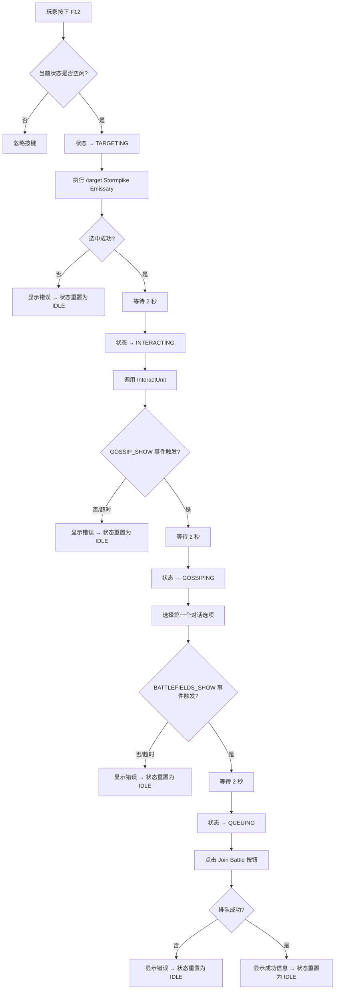
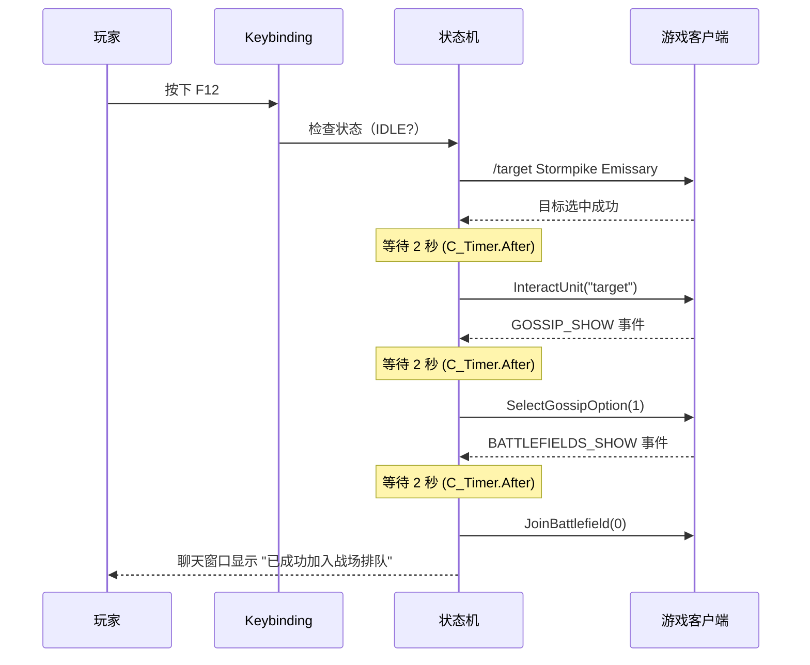

# 设计文档

## 概述

本插件（AVAutoQueue）是一个魔兽世界经典版（WoW Classic）Lua 插件，实现一键自动排队奥特兰克山谷战场的功能。玩家按下 F12 后，插件通过状态机驱动，依次完成：选中 NPC → 等待 → 交互 NPC → 等待 → 选择对话选项 → 等待 → 点击加入战场。整个流程采用事件驱动 + 定时器延迟的架构，确保每个步骤之间有 2 秒缓冲，避免因操作过快导致客户端未响应。

### 设计决策

1. **单文件架构**：WoW Classic 插件通常结构简单，本插件功能单一，采用单个 Lua 文件 + TOC 文件的最小结构，降低复杂度。
2. **状态机模式**：使用有限状态机管理流程步骤，状态变量控制事件响应和按键防重入，比回调嵌套更清晰可维护。
3. **C_Timer.After 延迟**：WoW Classic 支持 C_Timer.After API，用于实现非阻塞的 2 秒步骤间延迟，比 OnUpdate 轮询更简洁。
4. **事件驱动衔接**：利用 GOSSIP_SHOW 和 BATTLEFIELDS_SHOW 游戏事件检测 UI 窗口打开，而非盲目等待固定时间，提高流程可靠性。
5. **15 秒全局超时**：防止流程因异常卡死，超时后自动重置状态，允许玩家重新触发。

## 架构

### 整体架构

插件采用事件驱动 + 状态机的架构模式。核心组件通过共享状态变量协调，游戏事件和定时器驱动步骤推进。



### 文件结构

```
AVAutoQueue/
├── AVAutoQueue.toc          -- 插件描述文件
└── AVAutoQueue.lua          -- 插件主逻辑（单文件）
```

### 事件流时序图



## 组件与接口

### 1. 核心框架（Core Frame）

插件的事件监听载体，使用 CreateFrame 创建一个不可见的 Frame，注册游戏事件。

```lua
-- 创建核心 Frame
local frame = CreateFrame("Frame", "AVAutoQueueFrame", UIParent)
frame:RegisterEvent("GOSSIP_SHOW")
frame:RegisterEvent("BATTLEFIELDS_SHOW")
frame:SetScript("OnEvent", function(self, event, ...)
    -- 事件分发到对应处理函数
end)
```

### 2. 按键绑定模块（Keybinding Module）

通过 TOC 文件中的 Bindings.xml 或 SetBindingClick 注册 F12 快捷键。

接口：
- `AVAutoQueue_StartProcess()` — 流程入口函数，F12 按下时调用

### 3. 目标选中模块（Target Module）

接口：
- `TargetNPC()` — 执行宏命令选中 Stormpike Emissary
- 输入：无
- 输出：布尔值（是否选中成功）
- 依赖 WoW API：`TargetUnit("Stormpike Emissary")` 或 `/target` 宏，`UnitName("target")` 验证

### 4. NPC 交互模块（Interact Module）

接口：
- `InteractWithTarget()` — 与当前目标交互
- 输入：无
- 输出：无（通过 GOSSIP_SHOW 事件确认成功）
- 依赖 WoW API：`InteractUnit("target")`

### 5. 对话选择模块（Gossip Module）

接口：
- `SelectFirstGossipOption()` — 选择第一个对话选项
- 输入：无
- 输出：无（通过 BATTLEFIELDS_SHOW 事件确认成功）
- 依赖 WoW API：`SelectGossipOption(1)` 或 `C_GossipInfo.SelectOption(1)`

### 6. 战场排队模块（Queue Module）

接口：
- `JoinBattleQueue()` — 点击加入战场按钮
- 输入：无
- 输出：布尔值（是否成功）
- 依赖 WoW API：`JoinBattlefield(0)` 或 `AcceptBattlefieldPort(1, true)`

### 7. 状态管理器（State Manager）

接口：
- `GetState()` — 获取当前流程状态
- `SetState(newState)` — 设置流程状态
- `ResetState()` — 重置为 IDLE 状态并清理定时器
- `StartTimeout()` — 启动 15 秒全局超时定时器
- `CancelTimeout()` — 取消超时定时器

### 8. 消息输出模块（Message Module）

接口：
- `PrintMessage(msg)` — 在聊天窗口输出带前缀的提示信息
- 依赖 WoW API：`DEFAULT_CHAT_FRAME:AddMessage(msg)`

## 数据模型

### 流程状态枚举

```lua
local STATE = {
    IDLE        = "IDLE",        -- 空闲，等待 F12 触发
    TARGETING   = "TARGETING",   -- 正在选中 NPC
    INTERACTING = "INTERACTING", -- 已选中，等待/执行交互
    GOSSIPING   = "GOSSIPING",   -- 已交互，等待/执行对话选择
    QUEUING     = "QUEUING",     -- 已选择对话，等待/执行排队
}
```

### 核心状态变量

```lua
local addonState = {
    currentState = STATE.IDLE,   -- 当前流程状态
    timeoutTimer = nil,          -- 全局超时定时器引用
    stepTimer = nil,             -- 当前步骤延迟定时器引用
}
```

### 配置常量

```lua
local CONFIG = {
    NPC_NAME      = "Stormpike Emissary",  -- 目标 NPC 名称
    STEP_DELAY    = 2,                      -- 步骤间延迟（秒）
    TIMEOUT       = 15,                     -- 全局超时（秒）
    MSG_PREFIX    = "|cFF00FF00[AVAutoQueue]|r ",  -- 聊天消息前缀（绿色）
}
```

### 状态转换表

| 当前状态 | 触发条件 | 下一状态 | 动作 |
|---------|---------|---------|------|
| IDLE | F12 按下 | TARGETING | 执行 TargetNPC() |
| TARGETING | 选中成功 + 2秒延迟 | INTERACTING | 执行 InteractWithTarget() |
| TARGETING | 选中失败 | IDLE | 显示错误信息 |
| INTERACTING | GOSSIP_SHOW 事件 + 2秒延迟 | GOSSIPING | 执行 SelectFirstGossipOption() |
| INTERACTING | 超时 | IDLE | 显示错误信息 |
| GOSSIPING | BATTLEFIELDS_SHOW 事件 + 2秒延迟 | QUEUING | 执行 JoinBattleQueue() |
| GOSSIPING | 超时 | IDLE | 显示错误信息 |
| QUEUING | 排队成功 | IDLE | 显示成功信息 |
| QUEUING | 排队失败 | IDLE | 显示错误信息 |

