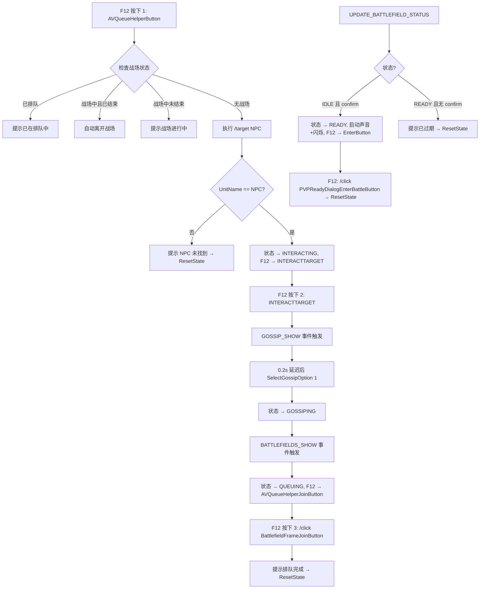
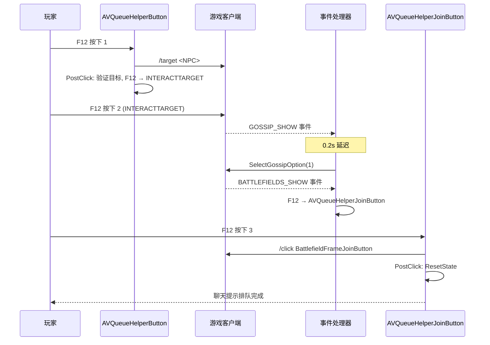
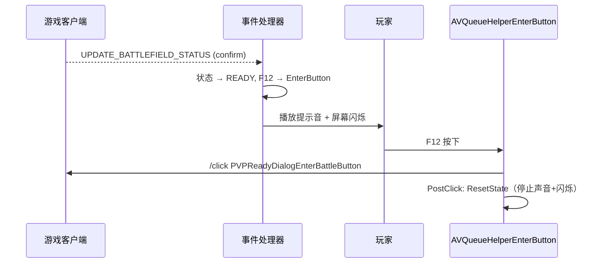

# 设计文档

## 概述

AVQueueHelper 是一个魔兽世界经典版（WoW Classic）Lua 插件，简化奥特兰克山谷（AV）战场排队流程。由于 WoW 的受保护 API（TargetUnit、InteractUnit、JoinBattlefield）只能在硬件事件的安全执行路径中调用，插件采用"三次按键 + 键位重绑定"的架构：玩家按下 F12 三次，每次触发不同的安全按钮，依次完成选中 NPC → 交互 NPC → 加入排队。插件根据玩家阵营自动选择对应 NPC（联盟 Stormpike Emissary / 部落 Frostwolf Emissary），并在排队弹出时通过声音和屏幕闪烁提醒玩家进入战场。

### 设计决策

1. **单文件架构**：功能单一，采用单个 Lua 文件 + TOC 文件的最小结构，降低复杂度。
2. **安全按钮 + 键位重绑定**：受保护 API 必须由硬件事件触发，无法在定时器回调中调用。通过创建多个 SecureActionButtonTemplate 按钮，在流程各阶段将 F12 重绑定到不同按钮，使每次按键执行不同的受保护操作。
3. **六状态有限状态机**：IDLE → TARGETING → INTERACTING → GOSSIPING → QUEUING 为排队流程，READY 为独立的排队弹出处理状态。状态守卫确保事件处理器只在预期状态下响应。
4. **Generation Counter 防过期回调**：每次 ResetState 递增 generation 计数器，定时器回调执行前检查 generation 是否匹配，避免状态重置后旧回调产生副作用。
5. **事件驱动衔接**：利用 GOSSIP_SHOW、BATTLEFIELDS_SHOW、UPDATE_BATTLEFIELD_STATUS 游戏事件检测 UI 状态变化，而非盲目等待固定时间。
6. **0.2 秒步骤延迟**：仅用于 GOSSIP_SHOW 后自动选择对话选项前的短暂缓冲，确保客户端 UI 就绪。
7. **6 秒全局超时**：防止流程因异常卡死，超时后自动清理所有状态并重置。
8. **日志级别系统**：支持 DEBUG/INFO/WARN/ERROR 四级，通过 CONFIG.LOG_LEVEL 控制最低输出级别，方便调试和生产使用。

## 架构

### 整体架构

插件采用事件驱动 + 状态机 + 安全按钮键位重绑定的架构模式。核心流程通过三次 F12 按键推进，每次按键触发不同的安全按钮。事件处理器在收到游戏事件后自动执行中间步骤（如选择对话选项），并将 F12 重绑定到下一阶段的按钮。



### 文件结构

```
AVQueueHelper/
├── AVQueueHelper.toc          -- 插件描述文件（Interface 11503）
└── AVQueueHelper.lua          -- 全部插件逻辑（单文件）
```

### 三次按键时序图



### 排队弹出时序图



## 组件与接口

### 1. 事件框架（Event Framework）

不可见 Frame，注册游戏事件并通过 `eventHandlers` 表分发到对应处理函数。

```lua
local eventHandlers = {}
local frame = CreateFrame("Frame", "AVQueueHelperFrame", UIParent)
frame:RegisterEvent("GOSSIP_SHOW")
frame:RegisterEvent("BATTLEFIELDS_SHOW")
frame:RegisterEvent("UPDATE_BATTLEFIELD_STATUS")
frame:SetScript("OnEvent", function(_, event, ...)
    if eventHandlers[event] then eventHandlers[event](...) end
end)
```

注册的事件：
- `GOSSIP_SHOW` — NPC 对话窗口打开
- `BATTLEFIELDS_SHOW` — 战场排队窗口打开
- `UPDATE_BATTLEFIELD_STATUS` — 战场状态变化（排队/弹出/进入）
- `PLAYER_LOGIN` — 玩家登录（初始化后注销）

### 2. 安全按钮（Secure Buttons）

三个 SecureActionButtonTemplate 按钮，通过 F12 键位重绑定在流程各阶段触发不同操作：

| 按钮名称 | 宏命令 | 触发阶段 | PostClick 行为 |
|---------|--------|---------|---------------|
| AVQueueHelperButton | `/target <NPC>` | 按下 1 | 验证目标，检查战场状态，重绑 F12 → INTERACTTARGET |
| AVQueueHelperJoinButton | `/click BattlefieldFrameJoinButton` | 按下 3 | 提示排队完成，ResetState |
| AVQueueHelperEnterButton | `/click PVPReadyDialogEnterBattleButton` | 排队弹出 | 提示进入战场，ResetState |

### 3. 状态管理（State Management）

接口：
- `GetState()` — 返回当前状态字符串
- `SetState(newState)` — 设置当前状态
- `ResetState()` — 完整清理：取消步骤定时器、取消超时定时器、停止提示音、停止屏幕闪烁、递增 generation、状态 → IDLE、F12 → AVQueueHelperButton
- `StartTimeout()` — 启动 6 秒全局超时定时器
- `CancelTimeout()` — 取消超时定时器

### 4. 日志系统（Logging）

接口：
- `PrintMessage(msg, level)` — 输出带前缀的聊天消息
  - `level` 默认 LOG_LEVEL.INFO
  - 低于 CONFIG.LOG_LEVEL 的消息被过滤
  - 前缀：`|cFF00FF00[AVQueueHelper]|r`

### 5. 提醒系统（Alert System）

声音提醒：
- `StartAlertSound()` — 立即播放 Sound Kit 1018，启动每 3 秒重复的 C_Timer.NewTicker
- `StopAlertSound()` — 取消 ticker

屏幕闪烁：
- `StartFlash()` — 显示全屏红色半透明 Frame（alpha 0.3），启动每 0.5 秒切换显示/隐藏的 ticker
- `StopFlash()` — 取消 ticker，隐藏 Frame

闪烁 Frame 结构：
- `AVQueueHelperFlashFrame` — TOOLTIP 层级全屏 Frame
- 内含一个红色 `SetColorTexture(1, 0, 0, 0.3)` 纹理

## 数据模型

### 流程状态枚举

```lua
local STATE = {
    IDLE        = "IDLE",        -- 等待玩家启动流程
    TARGETING   = "TARGETING",   -- /target 宏已执行，验证结果中
    INTERACTING = "INTERACTING", -- NPC 已选中，等待 F12 → INTERACTTARGET
    GOSSIPING   = "GOSSIPING",   -- 对话窗口打开，自动选择选项中
    QUEUING     = "QUEUING",     -- 战场窗口打开，等待 F12 → Join
    READY       = "READY",       -- 排队弹出，提醒玩家按 F12 进入
}
```

### 核心状态变量

```lua
local addonState = {
    currentState = STATE.IDLE,   -- 当前流程状态
    timeoutTimer = nil,          -- 全局超时定时器引用
    stepTimer    = nil,          -- 步骤延迟定时器引用
    generation   = 0,            -- 递增计数器，防止过期回调执行
    alertTimer   = nil,          -- 提示音重复 ticker 引用
    flashTimer   = nil,          -- 屏幕闪烁 ticker 引用
}
```

### 配置常量

```lua
local NPC_NAMES = {
    Alliance = "Stormpike Emissary",
    Horde    = "Frostwolf Emissary",
}

local CONFIG = {
    NPC_NAME       = nil,   -- PLAYER_LOGIN 时根据阵营动态设置
    STEP_DELAY     = 0.2,   -- 步骤间延迟（秒）
    TIMEOUT        = 6,     -- 全局超时（秒）
    KEYBIND        = "F12",
    MSG_PREFIX     = "|cFF00FF00[AVQueueHelper]|r ",
    ALERT_SOUND    = 1018,  -- Sound Kit ID
    ALERT_INTERVAL = 3,     -- 提示音间隔（秒）
    LOG_LEVEL      = LOG_LEVEL.INFO,
}
```

### 状态转换表

| 当前状态 | 触发条件 | 下一状态 | 动作 |
|---------|---------|---------|------|
| IDLE | F12 按下 + 无战场 | TARGETING | 执行 /target NPC |
| IDLE | F12 按下 + 已排队 | IDLE | 提示已在排队中 |
| IDLE | F12 按下 + 战场中已结束 | IDLE | LeaveBattlefield() |
| IDLE | F12 按下 + 战场中未结束 | IDLE | 提示战场进行中 |
| IDLE | UPDATE_BATTLEFIELD_STATUS + confirm | READY | 启动声音+闪烁，F12 → EnterButton |
| TARGETING | UnitName 匹配 NPC | INTERACTING | F12 → INTERACTTARGET |
| TARGETING | UnitName 不匹配 | IDLE | 提示 NPC 未找到，ResetState |
| INTERACTING | GOSSIP_SHOW 事件 | GOSSIPING | 0.2s 后 SelectGossipOption(1) |
| INTERACTING | 超时 | IDLE | ResetState |
| GOSSIPING | BATTLEFIELDS_SHOW 事件 | QUEUING | F12 → JoinButton |
| GOSSIPING | 超时 | IDLE | ResetState |
| QUEUING | F12 按下 (JoinButton) | IDLE | 提示排队完成，ResetState |
| QUEUING | 超时 | IDLE | ResetState |
| READY | F12 按下 (EnterButton) | IDLE | 提示进入战场，ResetState |
| READY | UPDATE_BATTLEFIELD_STATUS + 无 confirm | IDLE | 提示已过期，ResetState |
